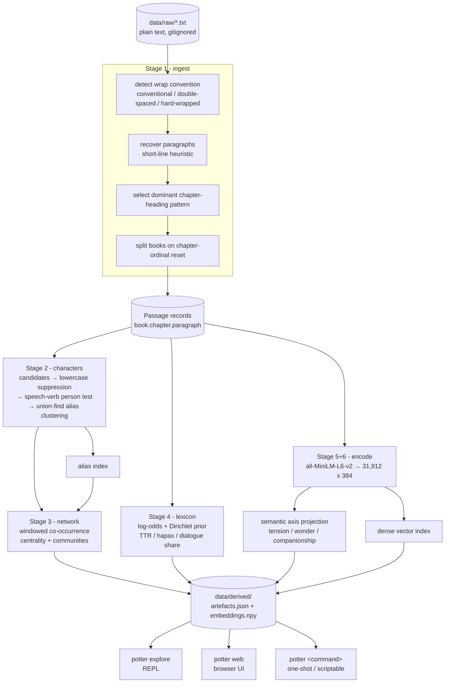

# potter - corpus intelligence for a book series

A pipeline that turns seven plain-text novels into a queryable model of the corpus,
plus an interactive tool for exploring it. Built for the Simply TV 90-minute
coding challenge.

The interesting part of a 1.1-million-word narrative corpus is not word frequency.
It is **structure**: who exists, who interacts with whom, how the vocabulary shifts
between volumes, and where the emotional shape of each book rises and falls. This
repository extracts those four things and puts them behind one interface.

---

## What it does

| Stage | Extraction method | Answers |
|---|---|---|
| 1. Ingest | Convention-detecting segmentation (book / chapter / paragraph) | What is the structure? |
| 2. Characters | Model-free NER + fuzzy alias resolution (union-find) | Who is in this corpus? |
| 3. Network | Windowed co-occurrence graph, weighted centrality, community detection | Who matters, and who bridges groups? |
| 4. Lexicon | Log-odds with informative Dirichlet prior; TTR, hapax, dialogue share | What is distinctive about each book? |
| 5. Arcs | Semantic axis projection in embedding space | What is the emotional shape of each book? |
| 6. Retrieval | Dense bi-encoder + lexical KWIC, fused with Reciprocal Rank Fusion | Where does *this* happen? |

Verified on the seven-novel corpus: **7 books, 198 chapters, 31,912 paragraphs,
1,123,470 words**, full pipeline in **~17 seconds** on a CUDA GPU.

---

## Flow diagram



The cache is the seam. Extraction runs once; every interface reads artefacts, so
exploration is instant rather than re-embedding per query.

---

## Usage

### Install

```bash
python -m venv .venv
.venv/Scripts/activate        # Windows;  source .venv/bin/activate on macOS/Linux
pip install -e .
```

### Supply a corpus

Drop one or more `.txt` files into `data/raw/`. Three input shapes work:

- one file per book (filename order sets series order)
- one file containing an entire series (books split on chapter-ordinal reset)
- one file, one book

Optionally add `data/raw/titles.txt`, one volume title per line, to label books.
Without it books are labelled `Book 1 … Book N`.

### Build the artefact cache

```bash
potter build
```

### Explore

```bash
potter explore                              # interactive REPL - recommended
potter web                                  # browser UI at http://127.0.0.1:8000
```

One-shot commands, all scriptable:

```bash
potter overview                             # corpus statistics
potter characters --top 20                  # resolved identities and aliases
potter network                              # centrality, brokers, communities
potter network --character hermione         # one character's strongest ties
potter arc --axis tension                   # narrative arc sparklines per book
potter distinctive                          # vocabulary unique to each book
potter search "a dangerous duel"            # hybrid semantic + lexical
potter search "..." --mode semantic         # dense only
potter kwic wand                            # exact concordance lines
```

Inside the REPL: `find`, `kwic`, `who`, `arc`, `top`, `net`, `words`, `stats`, `quit`.

---

## Core questions

**Why not use spaCy or an off-the-shelf NER model for characters?**
Two reasons. Portability - a model-free extractor runs on any corpus with no
download, which matters for anyone cloning this cold. And accuracy on fiction -
invented names are out-of-vocabulary for models trained on news, and NER gives no
alias resolution at all: it happily emits `Ron`, `Ron Weasley` and `Weasley` as
three unrelated entities. Alias resolution is most of the actual problem.

**How does character extraction work without a gazetteer?**
Four filters in sequence. (1) Candidate generation over capitalised token runs.
(2) Lowercase suppression - a real name is almost never seen lowercased, so the
corpus acts as its own stopword list, with no language-specific list to maintain.
(3) A person test - adjacency to a reported-speech verb, because institutions and
places do not speak. (4) Alias clustering by union-find over fuzzy match and token
containment.

**Why does the alias clustering not merge the whole Weasley family?**
Because a shared token is not evidence of one person. `Fred Weasley` and
`Ron Weasley` share a surname and are different people, so naive containment
collapses a family into a single identity - this was a real bug during the build.
Merging now requires either an identical given name, or a surname that belongs to
exactly one full name in the corpus. That is why `Granger` merges into
`Hermione Granger` but bare `Weasley` stays its own entity.

**Why measure emotional arcs with embeddings instead of a sentiment lexicon?**
Sentiment lexicons are tuned for product reviews, have no entry for most invented
vocabulary, and score "he drew his wand" as neutral. Instead we embed a set of
positive-pole and negative-pole probe sentences, take the difference of their
centroids as a unit axis, and project each passage onto it. The same machinery
yields any axis you can describe in a sentence - swap the probes and you get a
wonder axis or a companionship axis rather than only valence.

**Is that a real emotion score?**
No, and the tool says so in its output. It measures semantic similarity to the axis
poles. It is a directional, relative signal - useful for locating where a book
turns, not a calibrated affect measurement.

**Why both semantic and lexical search?**
They answer different questions. Dense retrieval finds a scene from a paraphrase
but cannot prove a term is absent. Lexical KWIC is exhaustive and verifiable but
misses paraphrase. Fusing them with Reciprocal Rank Fusion gives both; RRF is used
rather than score averaging because cosine similarities and match counts are not on
a comparable scale, so only the ranks are safe to combine.

**Why paragraph windows rather than paragraphs for co-occurrence?**
Dialogue in fiction alternates across paragraphs. A one-paragraph window misses
almost every two-person conversation, which is precisely the signal we want. The
window slides but never crosses a chapter boundary, so a scene break cannot invent
an interaction.

**What was the hardest part?**
Segmentation, by a wide margin, and it was silent. The source file is hard-wrapped
at ~58 characters with no indentation and blank lines at only some paragraph
breaks. A naive split yielded 281-word "paragraphs"; an earlier bug produced
10-word ones. Both are plausible-looking and both quietly degrade every downstream
stage. The fix keys off the geometry of wrapped text - lines inside a paragraph run
near the wrap width, and only the last line falls short. Separately, a stray
`I.`-style line was matching a fallback chapter pattern and being read as a
chapter-ordinal reset, which invented an eighth book. Selecting the file's dominant
heading pattern fixed it.

**How do you know segmentation is right, rather than just plausible?**
External corroboration, not self-consistency. The parser recovers 198 chapters
split 18 / 18 / 22 / 37 / 38 / 30 / 36 across seven books, which matches the
published chapter counts of the seven novels, and the per-book word counts track
their published lengths. Neither fact is used by the parser, so agreement is
independent evidence.

**Does this scale?**
The current shape is fine to roughly 10^6 passages. Embedding is the only heavy
stage (~15 s for 32k passages on a GPU) and is cached. Beyond that, exhaustive
cosine over a dense matrix is the bottleneck and would need an ANN index (FAISS,
HNSW). Character extraction is linear and streams.

---

## Corpus and copyright

`data/` is gitignored in its entirety. **No novel text is committed to this
repository** - only code.

The brief suggested downloading the text and pushing to a public repo. Analysing a
copy you own is fine; republishing a copyrighted novel on a public GitHub repo is
redistribution, and owning a copy does not grant that right. Since the deliverable
is the pipeline rather than the text, keeping the corpus local costs nothing and
avoids putting infringing content in a public repo under a real name.

The consequence for a reviewer is one extra step: supply your own `.txt`. The
pipeline is corpus-agnostic by design, so it runs on any prose corpus -
`scripts/fetch_demo_corpus.py` will pull public-domain novels from Project
Gutenberg if you want a zero-setup smoke test.

---

## Known limitations

Stated plainly, because these are the things I would fix next rather than things I
missed.

- **Place names can survive the person filter.** `Hogwarts` still ranks in the top
  15. Constructions like "said Hogwarts was the safest place" defeat a regex
  adjacency test; a dependency parse would resolve it.
- **Surnames shared by a family stay separate identities.** `Weasley` appears as its
  own entity. This is the deliberate trade-off against the family-merge bug - the
  ambiguous case is left unresolved rather than resolved wrongly.
- **No coreference resolution.** Pronouns are not attributed, so co-occurrence
  undercounts scenes where a character is present but named only once.
- **Arc axes are unvalidated.** The probe sentences were written by hand and never
  tested against human judgement. They should be evaluated against annotated
  passages before anyone trusts the numbers.
- **No test suite.** Correctness was verified by external corroboration of the
  segmentation and by running every command against the real corpus, not by unit
  tests. Given more time the segmentation heuristics are the first thing to pin
  down with fixtures, since they are where the silent failures live.

---

## Layout

```
potter/
  corpus.py      stage 1 - ingest, wrap-convention detection, segmentation
  characters.py  stage 2 - candidate generation, person test, alias resolution
  network.py     stage 3 - co-occurrence graph, centrality, communities
  lexicon.py     stage 4 - log-odds distinctive terms, lexical statistics
  arc.py         stage 5 - semantic axis construction and projection
  search.py      stage 6 - dense, lexical and fused retrieval
  build.py       pipeline orchestration and artefact cache
  cli.py         one-shot commands and the REPL
  web.py         browser UI
scripts/
  fetch_demo_corpus.py   public-domain corpus for a zero-setup smoke test
```
