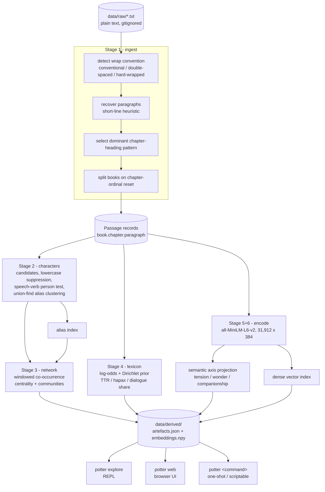

# potter - corpus intelligence for a book series

A pipeline that turns seven plain-text novels into a queryable model of the corpus,
and an interactive tool for exploring it. Built for the Simply TV 90 minute coding
challenge.

**Video demo:** _link to be added_

Word frequency is not the interesting part of a 1.1 million word narrative corpus.
Structure is. Who exists, who interacts with whom, how the vocabulary shifts between
volumes, and where the shape of each book rises and falls. This repo extracts those
four things and puts them behind one interface.

---

## What it does

| Stage | Extraction method | Answers |
|---|---|---|
| 1. Ingest | Convention-detecting segmentation (book / chapter / paragraph) | What is the structure? |
| 2. Characters | Model-free NER plus fuzzy alias resolution (union-find) | Who is in this corpus? |
| 3. Network | Windowed co-occurrence graph, weighted centrality, community detection | Who matters, and who bridges groups? |
| 4. Lexicon | Log-odds with an informative Dirichlet prior. TTR, hapax, dialogue share | What is distinctive about each book? |
| 5. Arcs | Semantic axis projection in embedding space | What is the shape of each book? |
| 6. Retrieval | Dense bi-encoder plus lexical KWIC, fused with Reciprocal Rank Fusion | Where does *this* happen? |

Verified on the seven novel corpus: **7 books, 198 chapters, 31,912 paragraphs,
1,123,470 words**. Full pipeline in **about 17 seconds** on a CUDA GPU.

---

## Techniques exhibited

The brief asked for a wide range of techniques. The inventory, and where each one
lives:

| Family | Technique | Where |
|---|---|---|
| Heuristic text processing | Wrap-convention detection, paragraph recovery from line geometry, dominant-pattern selection | `corpus.py` |
| Statistical NLP | Corpus-as-its-own-stopword-list via lowercase profiling | `characters.py` |
| Rule-based linguistics | Speech-verb personhood test, honorific handling, possessive folding | `characters.py` |
| Classical algorithms | Union-find for alias clustering, fuzzy string matching | `characters.py` |
| Graph theory | Weighted co-occurrence network, degree strength, betweenness centrality, greedy modularity communities | `network.py` |
| Bayesian statistics | Log-odds ratio with informative Dirichlet prior (Monroe et al. 2008) | `lexicon.py` |
| Corpus linguistics | Type/token ratio, hapax legomena, dialogue share, KWIC concordance | `lexicon.py`, `search.py` |
| Neural embeddings | Bi-encoder sentence embeddings (all-MiniLM-L6-v2), GPU batch encoding | `search.py`, `build.py` |
| Embedding-space geometry | Semantic axis construction and projection for narrative arcs | `arc.py` |
| Signal processing | Z-scoring, moving-average smoothing, sparkline resampling | `arc.py` |
| Information retrieval | Dense retrieval, lexical search, Reciprocal Rank Fusion | `search.py` |
| Engineering | Artefact cache pattern, CLI + REPL + dependency-free web server, pytest suite with synthetic fixtures | `build.py`, `cli.py`, `web.py`, `tests/` |

Deliberately absent: a generative LLM layer. `potter ask` - retrieval-augmented
answers over the corpus with citations - is the obvious capstone, but it needs an
API key at runtime, which would make it the one feature a reviewer cannot run from
a cold clone. In a 90 minute window I chose breadth that runs everywhere over a
headline feature that runs conditionally. It is first on the roadmap below after
coreference.

---

## Flow diagram



The cache is the seam. Extraction runs once, every interface reads the artefacts, so
exploring is instant instead of re-embedding on each query.

---

## Usage

### Install

```bash
python -m venv .venv
.venv/Scripts/activate        # Windows. Use source .venv/bin/activate on macOS or Linux
pip install -e .
```

### Supply a corpus

Drop one or more `.txt` files into `data/raw/`. Three input shapes work:

- one file per book, where filename order sets the series order
- one file holding a whole series, split on chapter-ordinal reset
- one file, one book

Optionally add `data/raw/titles.txt` with one volume title per line to label the
books. Without it they are labelled `Book 1` to `Book N`.

### Build the cache

```bash
potter build
```

### Explore

```bash
potter demo                                 # guided tour of the best findings, start here
potter explore                              # interactive REPL
potter web                                  # browser UI on http://127.0.0.1:8000
```

One-shot commands, all scriptable:

```bash
potter overview                             # corpus statistics
potter characters --top 20                  # resolved identities and aliases
potter network                              # centrality, brokers, communities
potter network --character hermione         # one character's strongest ties
potter pair harry ginny                     # relationship timeline for two characters
potter arc --axis tension                   # arc sparklines per book
potter arc --axis tension --character harry # the same, restricted to one character
potter distinctive                          # vocabulary unique to each book
potter search "a dangerous duel"            # hybrid semantic + lexical
potter search "..." --mode semantic         # dense only
potter kwic wand                            # exact concordance lines
```

In the REPL: `find`, `kwic`, `who`, `pair`, `arc`, `top`, `net`, `words`, `stats`,
`quit`.

### Tests

```bash
pytest tests -q
```

The heuristics are tested against small synthetic fixtures, so most of the suite
runs with no corpus present. The integration tests skip if you have not built the
cache.

---

## Interesting findings

The brief asked for interesting attributes of the corpus. These came out of the
tool, none of them were put in, and every number below is reproducible with the
command shown.

**Relationships have visible start dates.** `potter pair harry ginny` shows zero
shared passages in book one, a single spike in book two at the chapter where he
rescues her, then near silence until the count climbs through books five and six.
The tool has no idea who these people are. The shape alone tells you when the
relationship starts existing.

**The demo picks its own pair.** `potter demo` selects the pair whose interaction is
most concentrated late in the series, and on this corpus it lands on Snape and
Voldemort: single digits for five books, then 15 and 29 shared passages in the last
two. It finds the axis the series was quietly building towards.

**The brokers are not the stars.** By raw interaction volume the top three are
exactly who you would guess. But betweenness centrality surfaces Dudley, Vernon and
Petunia, because the Dursleys are the only bridge between the Muggle cluster and
everyone else. Tonks shows up the same way as a bridge into the Order. Two different
questions, two different answers, same graph.

**Each book has a vocabulary fingerprint.** `potter distinctive` recovers the plot
of each volume from word statistics alone. Book two is `lockhart, dobby, chamber,
riddle`. No topic model, just log-odds against the rest of the series.

**Alias resolution finds things a name list would not.** `Weasley Is Our King` and
`Dumbledore Army` both surface as aliases, because they are capitalised runs that
cluster with a character. Wrong in a charming way, and exactly the kind of artefact
an honest unsupervised method produces.

**The tool notices Sirius Black before the story does.** The presence timeline in
the web UI marks every character's first appearance, and it puts Sirius at book
one, chapter one - a passing name-drop as the owner of the motorbike Hagrid
borrows, two full books before he becomes a character. Mentions per chapter across
all 198 chapters also make absences and returns visible at a glance.

**The tension arcs find the climaxes, mostly.** `potter arc --axis tension` names a
peak chapter for each book, and in five of seven it is the chapter a reader would
call the climax: The Heir of Slytherin, The Third Task, The Only One He Ever Feared,
and so on. Books one and seven peak mid-book instead, on The Midnight Duel and The
Silver Doe, both intense scenes but not the endings. That hit rate from hand-written
probe sentences and no training is the honest result, and the misses are as
informative as the hits.

---

## Core questions

**Why not use spaCy or an off-the-shelf NER model for characters?**
Two reasons. Portability, because a model-free extractor runs on any corpus with no
download, which matters if you are cloning this cold. And accuracy on fiction.
Invented names are out of vocabulary for a model trained on news, and NER gives you
no alias resolution at all. It will happily emit `Ron`, `Ron Weasley` and `Weasley`
as three separate entities. Alias resolution is most of the actual problem.

**So how does extraction work without a gazetteer?**
Four filters in sequence. Generate candidates from runs of capitalised tokens. Then
suppress ordinary vocabulary, because a real name is almost never seen lowercased,
which lets the corpus act as its own stopword list with no language-specific list to
maintain. Then a person test, using adjacency to a reported-speech verb, because
places do not speak. Then cluster aliases with union-find over fuzzy match and token
containment.

**Why does the alias clustering not merge the whole Weasley family?**
Because a shared token is not evidence of one person. `Fred Weasley` and
`Ron Weasley` share a surname and are different people, so naive containment
collapses a family into a single identity. That was a real bug during the build, not
a hypothetical. Merging now needs either an identical given name, or a surname that
belongs to exactly one full name in the corpus. That is why `Granger` merges into
`Hermione Granger` but bare `Weasley` stays on its own.

**Why measure arcs with embeddings instead of a sentiment lexicon?**
Sentiment lexicons are tuned for product reviews, have no entry for most invented
vocabulary, and score "he drew his wand" as neutral. Instead I embed a set of
positive-pole and negative-pole probe sentences, take the difference of the two
centroids as a unit axis, and project each passage onto it. The same machinery gives
you any axis you can describe in a sentence, so swapping the probes gets you a
wonder axis or a companionship axis rather than only valence.

**Is that a real emotion score?**
No, and the tool says so in its own output. It measures semantic similarity to the
poles. It is a directional, relative signal. Good for finding where a book turns,
not a calibrated measure of affect.

**Why ship both semantic and lexical search?**
They answer different questions. Dense retrieval finds a scene from a paraphrase but
cannot prove a term is absent. Lexical KWIC is exhaustive and checkable but misses
paraphrase. Fusing them gives you both. I used Reciprocal Rank Fusion rather than
averaging the scores, because cosine similarity and match counts are not on a
comparable scale, so only the ranks are safe to combine.

**Why paragraph windows rather than paragraphs for co-occurrence?**
Dialogue alternates across paragraphs. A one-paragraph window misses almost every
two-person conversation, which is exactly the signal I want. The window slides but
never crosses a chapter boundary, so a scene break cannot invent an interaction.

**What was the hardest part?**
Segmentation, and it was silent. The source file is hard-wrapped at about 58
characters, has no indentation, and only puts a blank line at some paragraph breaks.
A naive split gave me 281 word paragraphs. An earlier bug gave me 10 word ones. Both
look plausible and both quietly degrade every stage downstream. The fix keys off the
geometry of wrapped text: lines inside a paragraph run near the wrap width, and only
the last line falls short. Separately, a stray `I.` line was matching a fallback
chapter pattern, being read as a chapter-ordinal reset, and inventing an eighth book.
Picking the file's dominant heading pattern fixed that.

**How do you know the segmentation is right and not just plausible?**
External corroboration rather than self-consistency. The parser recovers 198
chapters split 18 / 18 / 22 / 37 / 38 / 30 / 36 across seven books, which matches the
published chapter counts of the seven novels, and the per-book word counts track
their published lengths. The parser uses neither fact, so the agreement is
independent evidence.

**Does it scale?**
The current shape is fine to roughly a million passages. Embedding is the only heavy
stage, about 15 seconds for 32k passages on a GPU, and it is cached. Past that,
brute-force cosine over a dense matrix is the bottleneck and it needs an ANN index
like FAISS or HNSW. Character extraction is linear and streams.

---

## Decisions and trade-offs

Every one of these is a real choice with a cost. Listing the cost, not just the
choice.

**Corpus-agnostic pipeline instead of a Harry Potter specific one.**
Nothing below stage 1 knows which novels are loaded. This is why the same code
handles one file per book, a whole series in one file, and public-domain Gutenberg
text. The cost is that book titles are not recoverable from a single-file series, so
they come from an optional manifest or fall back to `Book N`.

**Model-free extraction instead of pretrained NER.**
Buys portability and alias resolution. Costs precision. A dependency parse would
sort out the place names that survive my speech-verb test.

**Leave ambiguity unresolved rather than resolve it wrongly.**
Bare `Weasley` stays a separate entity because the surname maps to several people.
An aggressive rule merges it into one of them and silently corrupts every count that
follows. I would rather ship an obvious artefact than a hidden error.

**One artefact cache, and every interface reads it.**
The CLI, REPL and web UI share one build. Adding an interface costs no pipeline work.
The cost is that the cache holds passage text, so it has to stay local and
gitignored.

**Stdlib http.server plus Jinja2 instead of FastAPI.**
Six read-only routes do not justify another dependency in a reviewer's install. The
cost is no async, no validation layer, and it is not something to put in production.

**Sparklines instead of plotted charts.**
Terminal-first, no matplotlib, and it demos in one screen. The cost is that you can
read the shape but not read a value off an axis.

**Verified by corroboration and integration runs, not by heavy unit testing.**
Under 90 minutes I put the checking where the silent failures live, which is
segmentation and alias resolution. Those have synthetic fixtures. I did not write
tests for the presentation layer beyond confirming every view renders.

---

## What I'd do with more time

Roughly in the order I would pick it up.

1. **Coreference resolution.** The biggest single accuracy win available. Pronouns
   are not attributed right now, so co-occurrence undercounts any scene where a
   character is present but named once. Every network metric is conservative because
   of it.
2. **Fix the place names properly.** `Hogwarts` still ranks in the top 15 because
   "said Hogwarts was the safest place" defeats a regex adjacency test. A dependency
   parse gives you the actual subject of the verb and settles it. I would not
   special-case the name.
3. **Validate the arc axes.** The probe sentences are hand-written and never tested
   against human judgement. I would annotate a couple of hundred passages, measure
   correlation, and either keep the axis or bin it. Until that happens the arcs are
   suggestive and the README should keep saying so.
4. **Scene segmentation instead of paragraph windows.** A fixed window is a proxy for
   a scene. Detecting real scene boundaries, on setting and time shifts, would make
   both the network and the arcs sharper.
5. **Cross-encoder reranking.** The bi-encoder retrieves candidates fast, but a
   cross-encoder pass over the top 50 would sharpen the ordering, and at k=8 the
   latency cost is nothing.
6. **An ANN index.** Needed the moment this goes past roughly a million passages.
   Not needed at 32k, so it would have been premature here.
7. **Track alias decisions in the output.** When two surface forms merge, record why.
   Debugging a wrong merge currently means re-reading the clustering code.
8. **Fixtures from more editions.** The wrap-convention detector is the riskiest part
   of the codebase and I have tested it against two real conventions plus synthetic
   cases. I would want a fixture per edition it is expected to handle.

---

## Corpus and copyright

`data/` is gitignored in full. **No novel text is committed to this repo.** Code
only.

The brief suggested downloading the text and pushing to a public repo. Analysing a
copy you own is fine. Republishing a copyrighted novel in a public GitHub repo is
redistribution, and owning a copy does not give you that right. The deliverable here
is the pipeline, not the text, so keeping the corpus local costs nothing and keeps
infringing content out of a public repo under a real name.

One extra step for a reviewer: supply your own `.txt`. The pipeline is
corpus-agnostic, so it runs on any prose corpus, and
`scripts/fetch_demo_corpus.py` pulls public-domain novels from Project Gutenberg if
you want a zero-setup smoke test.

---

## Layout

```
potter/
  corpus.py      stage 1, ingest, wrap-convention detection, segmentation
  characters.py  stage 2, candidate generation, person test, alias resolution
  network.py     stage 3, co-occurrence graph, centrality, communities
  lexicon.py     stage 4, log-odds distinctive terms, lexical statistics
  arc.py         stage 5, semantic axis construction and projection
  search.py      stage 6, dense, lexical and fused retrieval
  build.py       pipeline orchestration and artefact cache
  cli.py         one-shot commands and the REPL
  demo.py        guided tour of the findings
  web.py         browser UI
scripts/
  fetch_demo_corpus.py   public-domain corpus for a zero-setup smoke test
tests/
  test_pipeline.py       heuristics on synthetic fixtures, plus integration
```
